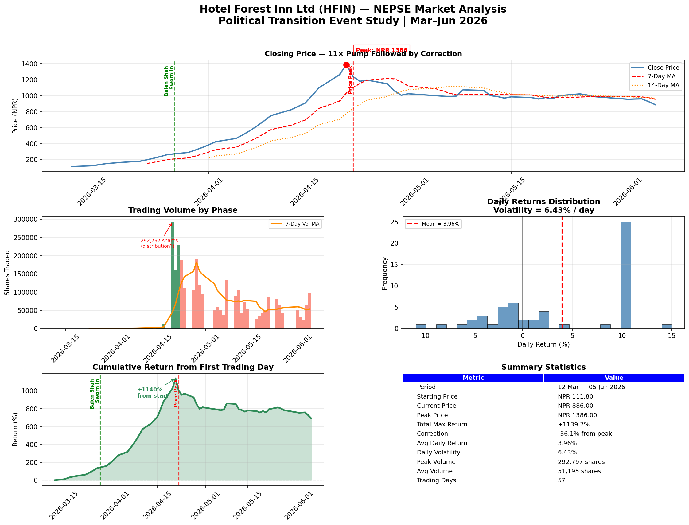

# HFIN — NEPSE Political Event Study
### Hotel Forest Inn Ltd | Nepal Stock Exchange | Real Market Data

A data science analysis of how Nepal's 2026 political 
transition affected HFIN stock — identifying speculation 
patterns, distribution signals, and thin-float behavior 
using real NEPSE trading data.

---

## The Story In Numbers

| Event | Date | Price (NPR) |
|---|---|---|
| Data starts (post-election) | Mar 12, 2026 | 111.8 |
| Balen Shah sworn in (RSP majority) | Mar 27, 2026 | 289.1 |
| Peak price | Apr 22, 2026 | 1,386 |
| Current | Jun 5, 2026 | 886.0 |
| **Total peak gain** | | **+1,140%** |
| Correction from peak | | -36.1% |

---

## Dashboard



---

## Key Findings

**1. Pre-event speculation**
Price pumped 2.3× *before* Balen Shah was
even sworn in — the market was pricing political 
anticipation, not fundamentals.

**2. Distribution signal at peak**
April 20 recorded the highest single-day volume
(292,797 shares) right at the price peak — a 
classic distribution pattern where institutional
players exit into retail FOMO buying.

**3. Thin-float behavior**
Normal trading volume: 10,000–40,000 shares/day.
Peak volume: 292,797. Daily volatility of 6.43% 
(Bitcoin-level) confirms thin-float manipulation 
susceptibility.

**4. Political catalyst, not fundamental value**
Hotel Forest Inn's stock movement was driven entirely 
by sentiment around Nepal's first majority government 
since 1999 — not by changes in hotel revenue or 
tourism fundamentals.

---

## Methodology

- **Event Study:** Price behavior analyzed ±30 days 
  around key political dates
- **Moving Averages:** 7-day and 14-day MA for 
  trend identification
- **Volume Analysis:** Color-coded by phase 
  (pre-event, pump, correction)
- **Return Distribution:** Daily % returns analyzed 
  for volatility and skew
- **Cumulative Return:** Full journey from baseline 
  to present

---

## Tech Stack

- Python 3.x
- Pandas — data wrangling & feature engineering
- NumPy — numerical computation
- Matplotlib — custom dark-theme dashboard

---

## How to Run

```bash
git clone https://github.com/sushanttds-jpg/hfin-nepse-analysis
cd hfin-nepse-analysis
pip install pandas numpy matplotlib
python hfin_dashboard.py
```

---

## Data Source

Real trading data from 
[Nepal Stock Exchange](https://nepalstock.com.np)
Stock: HFIN (Hotel Forest Inn Limited)
Period: March 12 – June 5, 2026

---

## Political Context

Nepal's March 2026 general election brought 
Balendra Shah (RSP) to power — the country's 
first majority government since 1999. The 
hotel/tourism sector was viewed as a direct 
beneficiary, triggering speculative buying 
across NEPSE hotel stocks.

---

## About

Built as part of my data science portfolio  
@ School of Mathematical Sciences, Tribhuvan University  
📍 Kathmandu, Nepal | 🎯 Building toward Erasmus Mundus EMJM
